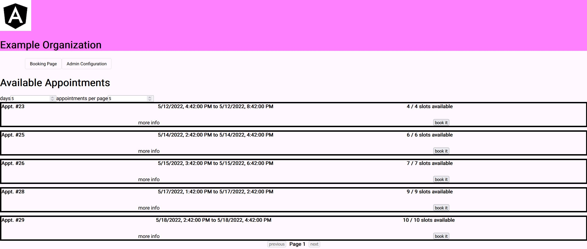
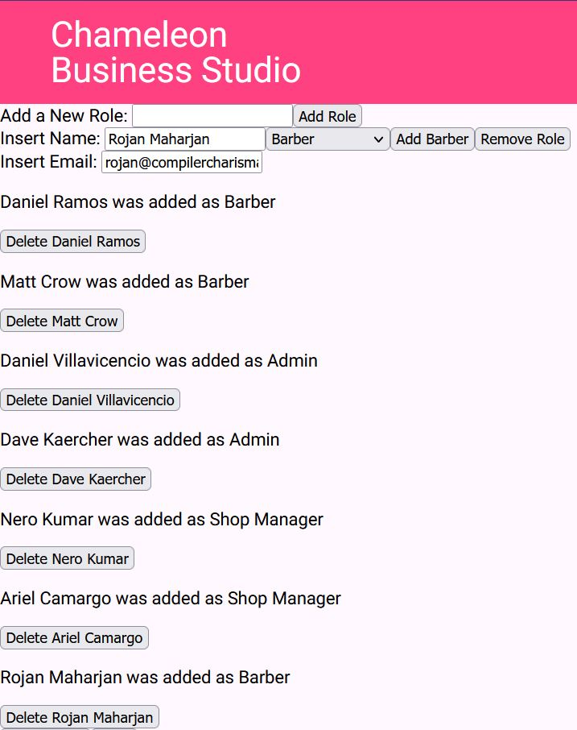
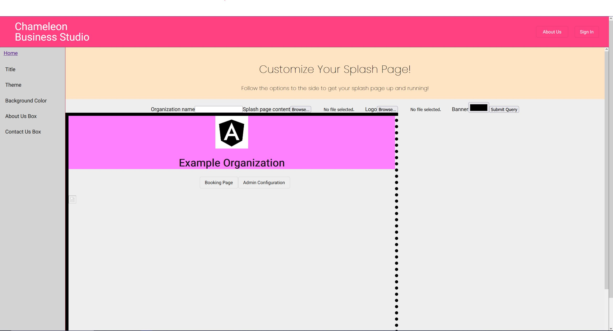

# Chameleon Business Studio

An open source scheduling application, usable and maintainable without an extensive Information
Technology department.

## Synopsis
Chameleon Business Studio aspires to adapt to its users, changing itself to "blend into" their needs until it supports their vital information systems. Our project provides an open-source scheduling application template that can be tailored to an individual or organization’s needs. After a brief configuration process, the application is usable "out of the box", with [Vendia](https://www.vendia.net/) providing data-layer hosting, perfect for individuals and organizers with little technical support.

## Application Screenshots

#### Splash Page. This is the default splash page for our application. The user of our application will be able to customize the look of their splash page to their own liking. </br>


#### Booking Page. This page presents the users with available appointments for them to book themselves. 


#### Admin Panel. Allows administrators to generate users and assign them specific roles. Classification of users is an integral feature to distinguish permissions between different business roles.


#### Splash Page Configuration. Allows the administrator/business owner to customize the splash page by changing the site banner and content. This will replace the look of the splash page demonstrated above.



## Setting up the application

TODO add instructions for setting environment variables

### Angular CLI

1. Make sure you have Node.Js installed in your local machine

https://nodejs.org/en/

2. At the time of cloning the repository, if you go to ChameleonBusinessStudio/angular-app and there is no directory called /node_modules
    
    1. First change directory to /angular-app
    2. Run the command `> npm i`
    3. You should see the /node_modules installed in the directory
    4. Run the command `> npm install -g @angular/cli` to install Angular CLI globally
    5. Lastly, install typescript by running the command `> npm install -g typescript`

3. By then, hopefully all the error messages are gone now

4. Also, since we will be using most of the styles and component from @Angular/material it is important that we import and make use of the UI Package

    1. Once everything is installed, go to `/angular-app/` directory
    2. run the command `> npm install --save @angular/material @angular/cdk`
    3. Double check that under `/angular-app/angular.json` in line 32, the first stylesheet Angular is using is `"./node_modules/@angular/material/prebuilt-themes/indigo-pink.css"`, if its not, then you can go ahead and copy and paste it as the first element of the json array.

### Database

While the application will eventually be migrated to Vendia, it currently uses a
a database on the running machine.

1. Run the following commands in mysql:

```
CREATE DATABASE chameleon_business_studio;
CREATE USER 'springuser'@'%' IDENTIFIED BY 'password';
GRANT ALL ON chameleon_business_studio.* TO 'springuser'@'%';
```

where ```password``` is a password of your choice (remember it for later!)

2. fill in the password field in the application.properties file

for example, if the password is ```password123```, the line should look like 
this: ```spring.datasource.password=password123```


### Google API Credentials

1. create your Google API credentials for Login with Google

    1. https://developers.google.com/identity/gsi/web/guides/overview
    2. https://developers.google.com/identity/gsi/web/guides/get-google-api-clientid
    3. add "http://localhost:8080" and "http://localhost" as authorized **JS origins**
    4. add "http://localhost:8080/login/oauth2/code/google" as an authorized **REDIRECT**

2. update `application.properties`

for example, if your Google Client Id is `123456789-abcde12345.apps.googleusercontent.com`,
and your Google Client Secret is `ABCDE-abcde12345`
your application.properties should contain these:
```    
spring.security.oauth2.client.registration.google.clientId=123456789-abcde12345.apps.googleusercontent.com
spring.security.oauth2.client.registration.google.clientSecret=ABCDE-abcde12345
```


## Launching the application

To run the application, you'll need to make sure your Angular App is built, if
not, navigate to the ```/angular-app``` directory and run

```gradle build```
 
once the Angular App is built, run spring via

```gradle bootRun```

You can now access the web application via ```http://localhost:8080```
For a list of application routes, check out [routes.txt](./docs/routes.txt)

## Jira Timeline: Plan for CSC 191
Sprint 5: Begin Mitigating Data Layer to Vendia's Data Services. </br>
Sprint 6: Implement Functionality to Appointment Booking Pages </br>
Sprint 7: Implement Notifications and a Simple Statistics Functionality </br>
Sprint 8: Data Deletion Implementation </br>
Sprint 9: Polish Up the Application </br>
Sprint 10: Deliver Documentation (User Guide, Maintainance Manual, Test Doc) and Deployment

## API Documentation

While the app is running, you can view its documentation at http://localhost:8080/webjars/swagger-ui/index.html

## Misc

The application stores website configuration information in your home folder, in
```ChameleonBusinessStudio```

- [About springdoc](https://springdoc.org/)
