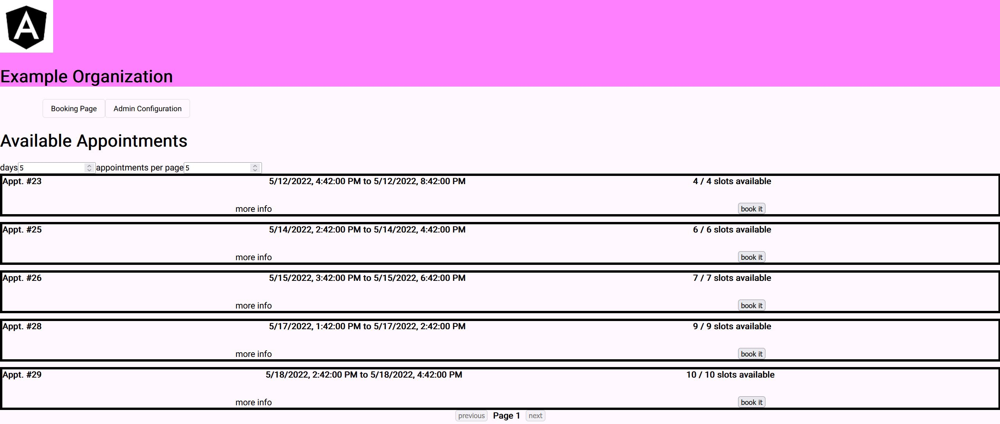
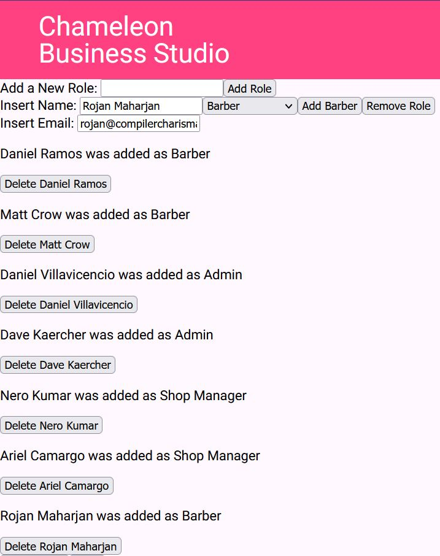
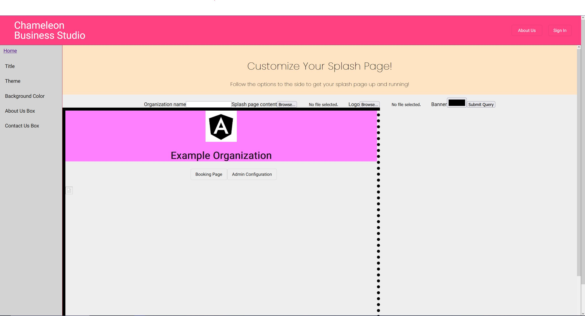

# Chameleon Business Studio

An open source scheduling application, usable and maintainable without an extensive Information
Technology department.

## Synopsis
Chameleon Business Studio aspires to adapt to its users, changing itself to "blend into" their needs until it supports their vital information systems. Our project provides an open-source scheduling application template that can be tailored to an individual or organization’s needs. After a brief configuration process, the application is usable "out of the box", with [Vendia](https://www.vendia.net/) providing data-layer hosting, perfect for individuals and organizers with little technical support.

## Application Screenshots

#### Splash Page. This is the default splash page for our application. The user of our application will be able to customize the look of their splash page to their own liking. </br>


#### Booking Page. This page presents the users with available appointments for them to book themselves. 


#### Admin Panel. Allows administrators to generate users and assign them specific roles. Classification of users is an integral feature to distinguish permissions between different business roles.


#### Splash Page Configuration. Allows the administrator/business owner to customize the splash page by changing the site banner and content. This will replace the look of the splash page demonstrated above.



## Setting up the application

TODO add instructions for setting environment variables

### Angular CLI

1. Make sure you have [Node.Js](https://nodejs.org/en/) installed in your local machine

2. At the time of cloning the repository, if you go to ChameleonBusinessStudio/angular-app and there is no directory called /node_modules
    
    1. First change directory to /angular-app
    2. Run the command `> npm i`
    3. You should see the /node_modules installed in the directory
    4. Run the command `> npm install -g @angular/cli` to install Angular CLI globally
    5. Lastly, install typescript by running the command `> npm install -g typescript`

3. By then, hopefully all the error messages are gone now

4. Also, since we will be using most of the styles and component from @Angular/material it is important that we import and make use of the UI Package

    1. Once everything is installed, go to `/angular-app/` directory
    2. run the command `> npm install --save @angular/material @angular/cdk`
    3. Double check that under `/angular-app/angular.json` in line 32, the first stylesheet Angular is using is `"./node_modules/@angular/material/prebuilt-themes/indigo-pink.css"`, if its not, then you can go ahead and copy and paste it as the first element of the json array.

## Launching the application

To run the application, you'll need to make sure your Angular App is built, if
not, navigate to the ```/angular-app``` directory and run

```gradle build```
 
once the Angular App is built, run spring via

```gradle bootRun```

You can now access the web application via ```http://localhost:8080```
For a list of application routes, check out [routes.txt](./docs/routes.txt)

## API Documentation

While the app is running, you can view its documentation at http://localhost:8080/webjars/swagger-ui/index.html

## Testing

You can verify the application works using unit-tests and integration tests. For
more information, see our testing document TODO: link to testing document

### Unit Tests

You can run unit tests using the command `gradle test` or `./gradlew test`.
These tests are very fast, and check if each component works as intended.

### Integration Tests

You can run integration tests using the command `gradle integration` or `./gradlew integration`.
Note that these tests are very thurough, but are also slow.

## Contributors

- [Matt Crow](https://github.com/matt-crow) - mattcrow19@gmail.com
- todo add yourselves! 

## Known Issues

- Since the app stores some configuration information on the local file system,
  it will not work on distributed systems, so it needs a single host machine.

## Misc

- The application stores website configuration information in your home folder, 
  in a folder named ```ChameleonBusinessStudio```
- [About springdoc](https://springdoc.org/)
- todo link to user manual
