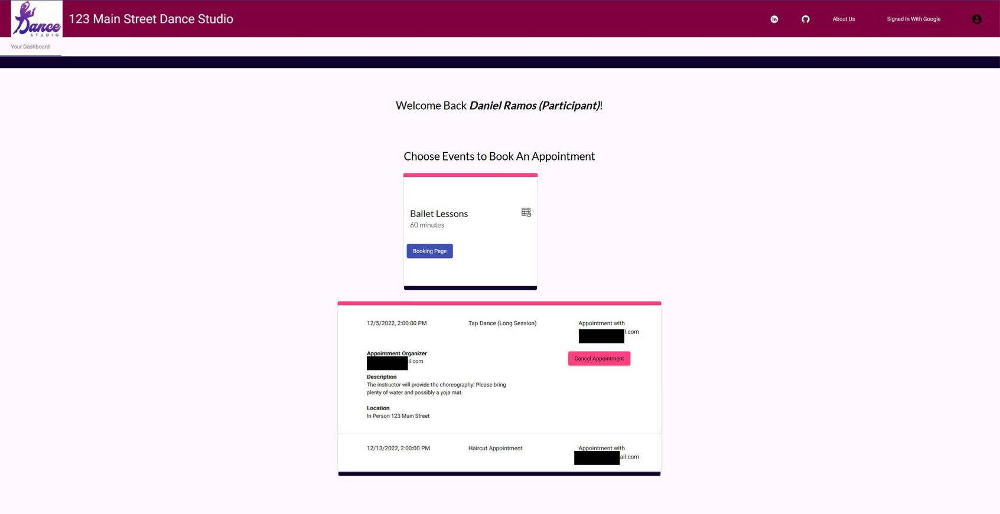
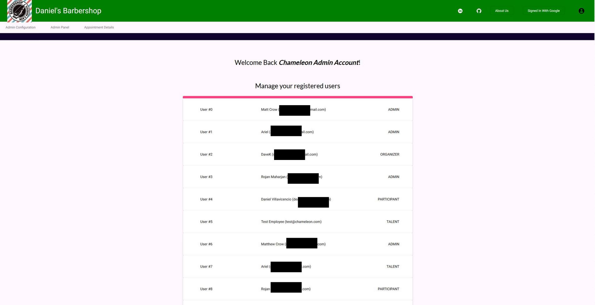
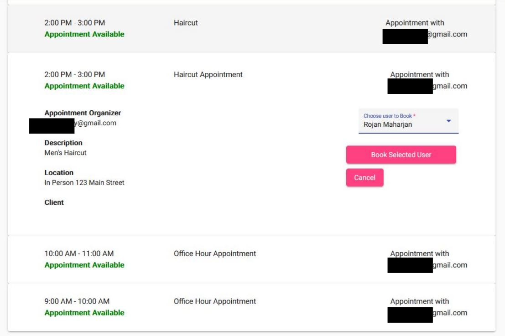
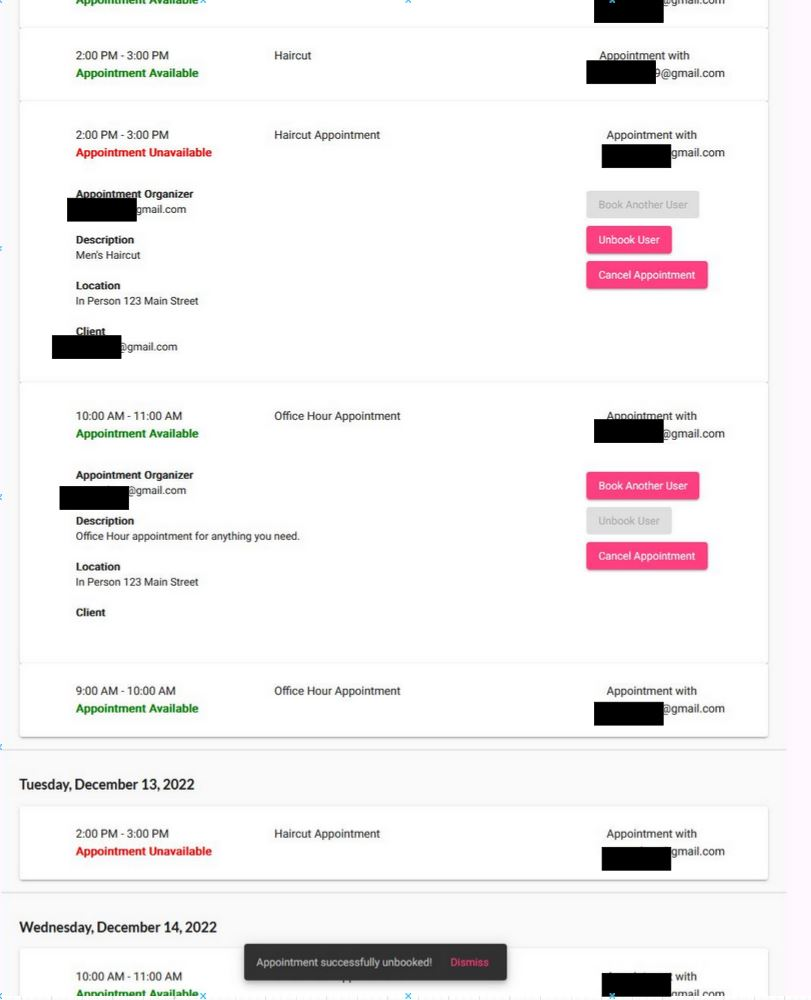
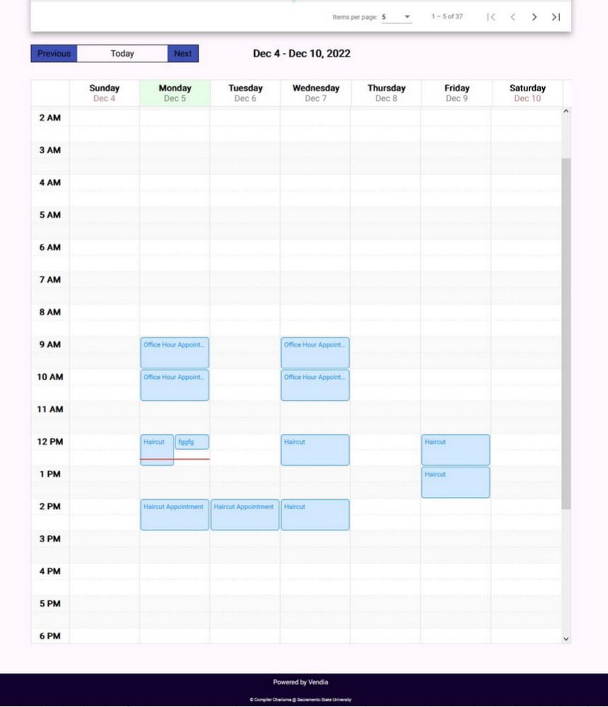
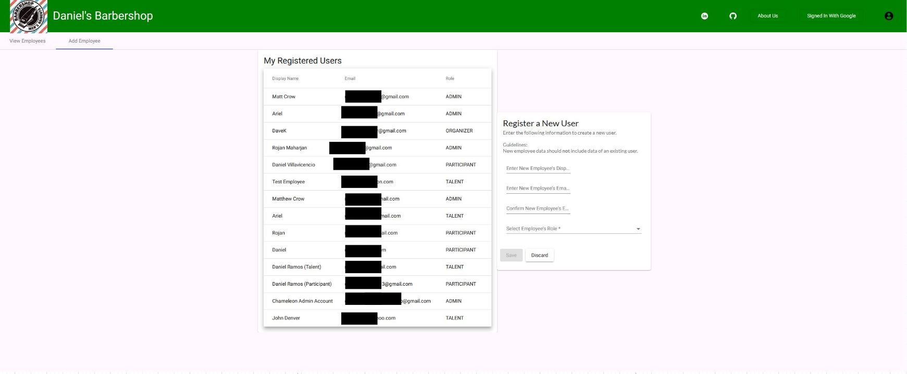
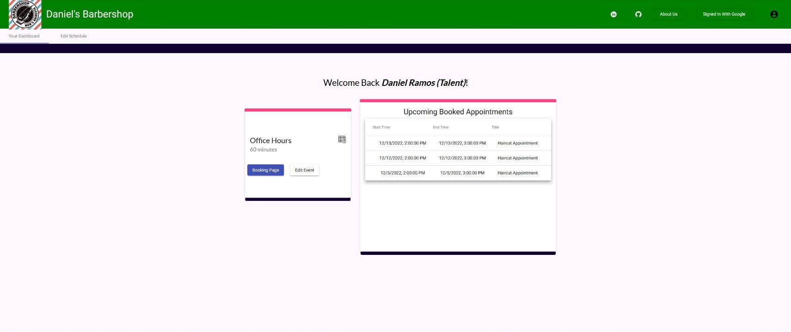
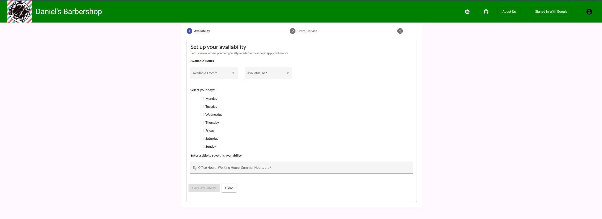
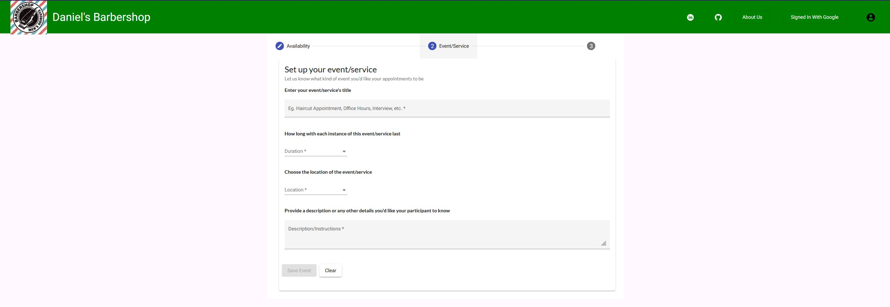

# Chameleon Business Studio

An open source scheduling application, usable and maintainable without an extensive Information
Technology department.

## Synopsis
Chameleon Business Studio aspires to adapt to its users, changing itself to "blend into" their needs until it supports their vital information systems. Our project provides an open-source scheduling application template that can be tailored to an individual or organization’s needs. After a brief configuration process, the application is usable "out of the box", with [Vendia](https://www.vendia.net/) providing data-layer hosting, perfect for individuals and organizers with little technical support.

## Application Screenshots

#### Participant account dashboard. This is a barbershop example, so someone who owns a barbershop can use this template for their business. Participants would be clients who want to book appointments with barbers. </br>


#### Participant account dashboard. This is a dance studio example, so someone who owns a dance studio can use this template for their business. Participants would be clients who want to book dance lessons. 


#### Admin account dashboard. A list of users will be provided for the user who can manage all users who are registered for the app. The user can change the role of the users from here.


#### Booking page. This example shows an example of a talent user booking another user for a haircut appointment.


#### Booking page showing an admin account who has access to all the appointments on the site. The user can perform operations such as booking other users, unbooking appointments, and viewing who the clients are in each appointment.


#### Booking page where the appointments appear in the form of a calendar instead of a list as demonstrated above.


#### Admin panel page where the user can register a new user to the site. The form on the right is used to enter the new user's details and will appear on the table to the left when saved successfully.


#### Talen account dashboard. The talent account will have a widget that holds information about the event they have configured, in this case it is an Office Hour event with a link to its booking page. It also has a list of upcoming appointments that have been booked to this account.


#### The first form in the schedule configuration page. The talent account will configure their availability for their schedule to be generated around.


#### The second form in the schedule configuration page. The talent account will configure their event or service details for their appointments.



## Setting up the application

TODO add instructions for setting environment variables

### Angular CLI

1. Make sure you have [Node.Js](https://nodejs.org/en/) installed in your local machine

2. At the time of cloning the repository, if you go to ChameleonBusinessStudio/angular-app and there is no directory called /node_modules
    
    1. First change directory to /angular-app
    2. Run the command `> npm i`
    3. You should see the /node_modules installed in the directory
    4. Run the command `> npm install -g @angular/cli` to install Angular CLI globally
    5. Lastly, install typescript by running the command `> npm install -g typescript`

3. By then, hopefully all the error messages are gone now

4. Also, since we will be using most of the styles and component from @Angular/material it is important that we import and make use of the UI Package

    1. Once everything is installed, go to `/angular-app/` directory
    2. run the command `> npm install --save @angular/material @angular/cdk`
    3. Double check that under `/angular-app/angular.json` in line 32, the first stylesheet Angular is using is `"./node_modules/@angular/material/prebuilt-themes/indigo-pink.css"`, if its not, then you can go ahead and copy and paste it as the first element of the json array.

## Launching the application

To run the application, you'll need to make sure your Angular App is built, if
not, navigate to the ```/angular-app``` directory and run

```gradle build```
 
once the Angular App is built, run spring via

```gradle bootRun```

You can now access the web application via ```http://localhost:8080```
For a list of application routes, check out [routes.txt](./docs/routes.txt)

## API Documentation

While the app is running, you can view its documentation at http://localhost:8080/webjars/swagger-ui/index.html

## Testing

You can verify the application works using unit-tests and integration tests. For
more information, see our testing document: [System Test Manual](https://drive.google.com/file/d/1mtnvVTMj3DmtRkPomzXweAng4owOAyAM/view?usp=share_link)

### Unit Tests

You can run unit tests using the command `gradle test` or `./gradlew test`.
These tests are very fast, and check if each component works as intended.

### Integration Tests

You can run integration tests using the command `gradle integration` or `./gradlew integration`.
Note that these tests are very thurough, but are also slow.

## Contributors

- [Matt Crow](https://github.com/matt-crow) - mattcrow19@gmail.com
- [Daniel Villavicencio](https://github.com/dvillavicencio) - daniel.villavicencio.mena@gmail.com
- [Daniel Ramos](https://github.com/rramsdany) - rramsdany@gmail.com
- [Dave Kaercher](https://github.com/dkaercher) - davekaercher@csus.edu
- [Rojan Maharjan](https://github.com/Rojanmhj2055) - Rmaharjan@csus.edu 
- [Ariel Camargo](https://github.com/arielcamargo) - arielcamargo@csus.edu

## Known Issues

- Since the app stores some configuration information on the local file system,
  it will not work on distributed systems, so it needs a single host machine.

## Misc

- The application stores website configuration information in your home folder,
  or the folder set by the `CHAMELEON_HOME` environment variable,
  in a folder named ```ChameleonBusinessStudio```
- [About springdoc](https://springdoc.org/)
- [Maintenance Manual](https://drive.google.com/file/d/15oDuD2Z9YZCRYC_f8VAEx7H-kgWad9Qz/view?usp=share_link)
- [System Test Report](https://drive.google.com/file/d/1mtnvVTMj3DmtRkPomzXweAng4owOAyAM/view?usp=share_link)
- [User Manual](https://drive.google.com/file/d/1_0SBKNKQJ3muwa9MGUwQJV3lH2nZGi4H/view?usp=share_link)
